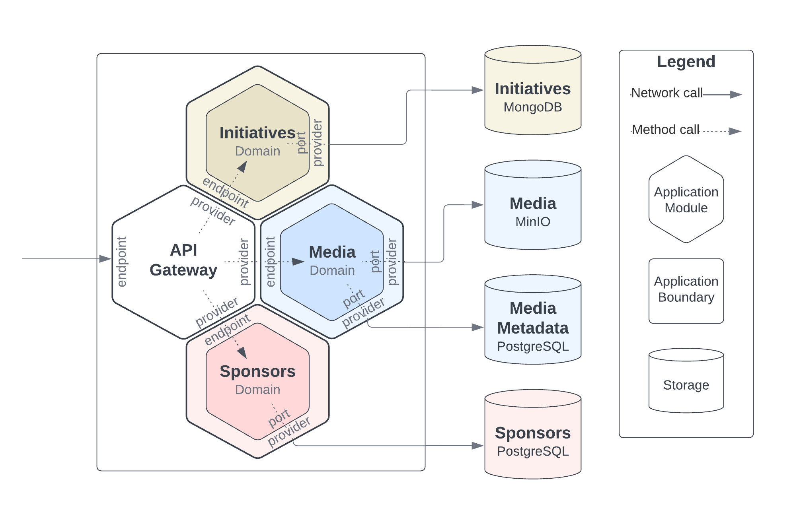
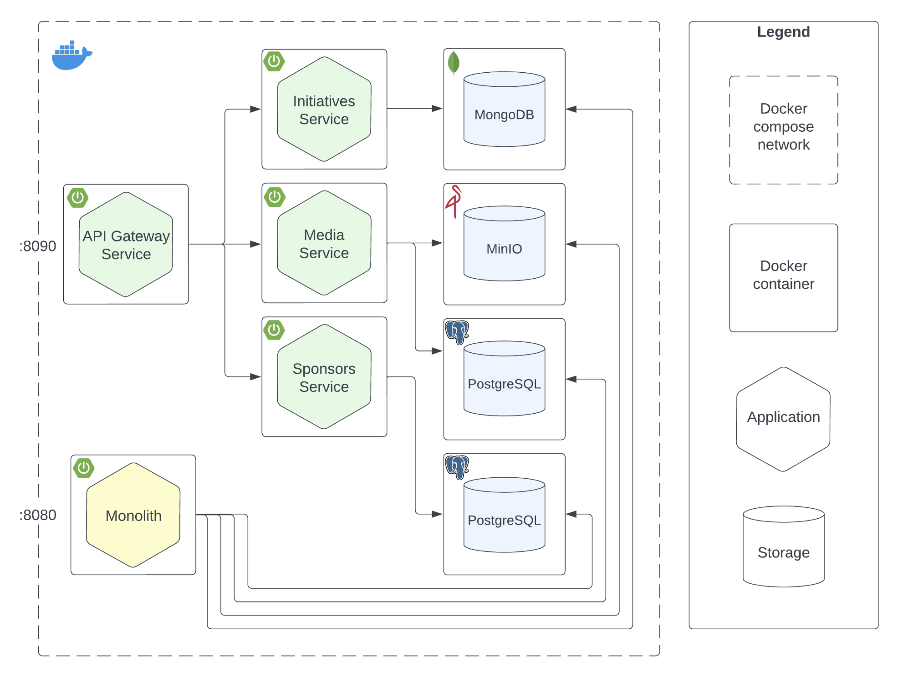

# Honeycomb Monolith

#### Hexagonal Modular Pattern for Agile Microservices Evolution

## Overview

Honeycomb Monolith is an architectural pattern that solves the problem of monolith to microservices decomposition.
It proposes a hexagonal modular structure that isolates domains and data, ideal for greenfield projects that want
the ability of seamless evolution into microservices.
This architecture allows for flexible, maintainable, and scalable software development.

Check out my [master's thesis](https://er.auk.edu.ua/items/18c552cd-3e35-4b5b-9f43-690b069fc4f4) for details.

# Pattern Concept

## Key ideas

* Identify domains early on
* Separate the data from the start
* Enclose domain model and logic in separate modules
* Structure each module as a hexagon

The Honeycomb Monolith pattern is a forward-thinking approach in the design of monolithic applications, where
Domain-Driven Design principles are integrated with the adaptable Hexagonal Architecture. This pattern distinctly
identifies and separates business domains along with their associated data, organizing the application into modules,
each representing an individual domain. These components are structured as hexagons to isolate the domain logic from
external communication interfaces. This symbolically represents the pattern’s core philosophy: ike a honeycomb’s
hexagonal cells, each module in this pattern is self-contained and poised for an effortless transition into an
independent microservice.

## Benefits

* Cohesive modularity
* Agile and smooth transition to microservices (domain and data not affected)
* Decreased long-term maintenance cost
* Ease of integration with external systems

## Considerations

* Requires domain modeling
* Distributed transaction (across domains)
* Governance effort
* Model duplication and extensive mapping

# Example implementation

This project provides an example implementation of the [Opora API](https://tarasshablii.github.io/opora-api/). The
application enables managing humanitarian Initiatives to address urgent crises and provide aid to those in need.
A relevant topic amid the ongoing russian invasion in Ukraine (see [Support Ukraine](#support-ukraine) section).
Initiatives are managed by Sponsors - either individuals or organizations. Application also provides means to store and
retrieve Media. All inbound requests come through the uniform API provided by API Gateway domainless module. For the
sake of technological diversity Initiatives are stored in MongoDB, Media files are stored in MinIO with metadata in
PostgreSQL, and Sponsors reside in a separate instance of PostgreSQL.


## Getting Started

### Prerequisites

Before you begin, ensure you have the following installed:

* JDK 21 (Amazon Corretto 21 recommended)
* Docker and Docker Compose

### Build

```shell
./gradlew clean build
```

### Run application

You can run the application either as Dockerized containers (recommended) or as standalone Spring Boot
services.

#### Run as docker containers

```shell
docker compose --profile monolith --profile microservices up -d
```

#### Run as Spring Boot services

1. Start the required dependencies `docker compose up -d`
2. Run monolith Spring Boot application `./gradlew :monolith:bootRun`
3. Run apigateway service `./gradlew :microservices:apigateway:bootRun`
4. Run initiatives service `./gradlew :microservices:initiatives:bootRun`
5. Run media service `./gradlew :microservices:media:bootRun`
6. Run sponsors service `./gradlew :microservices:sponsors:bootRun`

### Accessing the Application

* Feel free to use the attached [postman collection](postman-collection/Opora-API.postman_collection.json) to send
  requests to a running application.
* The monolith application will be accessible on http://localhost:8080.
* Monolith Swagger UI for API documentation can be accessed at http://localhost:8080/swagger-ui/index.html.
* The microservices application will be accessible on http://localhost:8090.
* Microservices Swagger UI for API documentation can be accessed at http://localhost:8090/swagger-ui/index.html.



### Stop application

* To stop monolith and microservices applications running in a containers,
  use `docker compose --profile monolith --profile microservices down -v`
* To stop dependencies, use `docker compose down -v`
* To stop Spring Boot applications running in shell, kill each job via `control+c` or `Ctrl+c`

# Support Ukraine

As Ukraine fights for its survival and for the values of freedom and self-determination we need your support!
Our warriors show that the only way to stop the russian terroristic invasion is on the battlefield.
Please, help us fight for our freedom and stop the spread of russian tyranny.
Donate to any of these trusted funds and spread the word:

* [UNITED24](https://u24.gov.ua/)
* [Come Back Alive](https://savelife.in.ua/en/)
* [Serhiy Prytula Charity Foundation](https://prytulafoundation.org/en)
